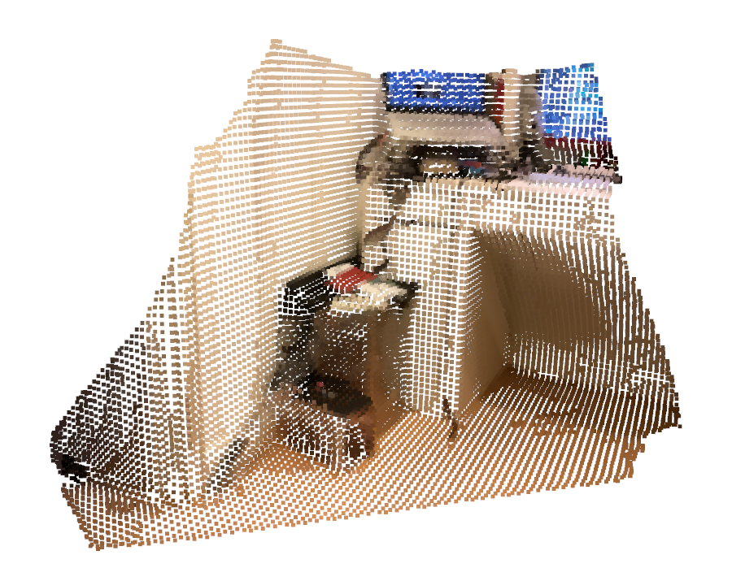
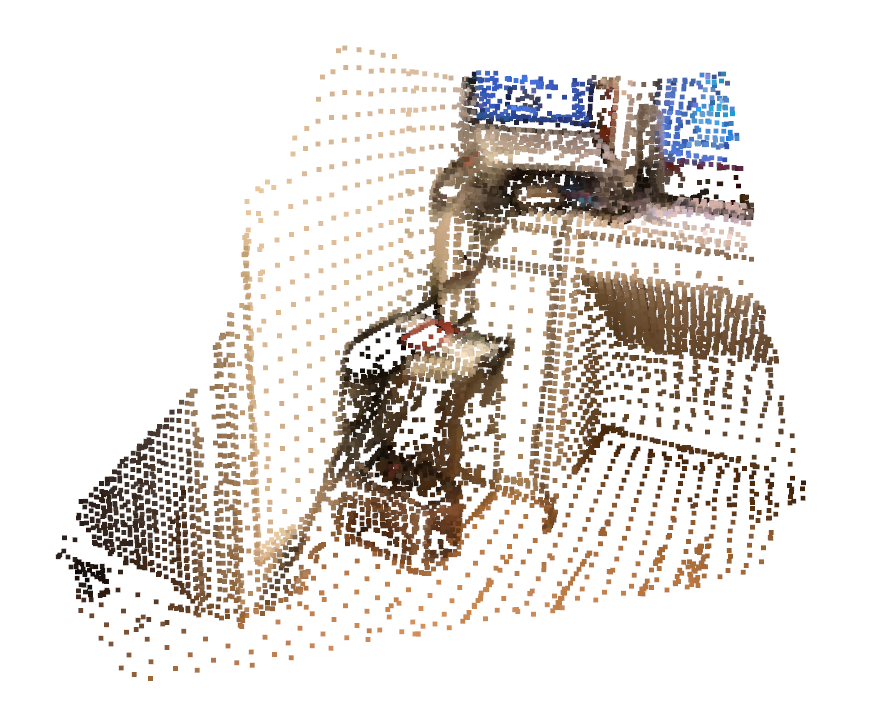

# Open3D Training

## Deadline

Wed, 2025-06-11

## Goal

Learn how to use [Open3D](https://www.open3d.org/docs/release/) and [NumPy](https://numpy.org/doc/stable/) to process images and point clouds.

## Tasks

Use [Open3D](https://www.open3d.org/docs/release/) and [NumPy](https://numpy.org/doc/stable/) to construct a single point cloud from RGB and depth images given the intrinsics and extrinsics of the camera at each image.

1. Load rgb, depth, camera matrix (then convert to Open3D camera intrinsics), and odometry (extrinsics).

2. Convert RGBD images to point clouds.

3. Combine point clouds from all images into a single point cloud.

4. Down sample the combined point cloud.

5. Visualize the combined point cloud.

6. Optional additional processing: down sample the point clouds according to RGB images' edge and color variance (you are free to explore ways to save space while preserving the point cloud's structure).

## Result

The result should looks like this:

The result with additional processing may look something like this:
